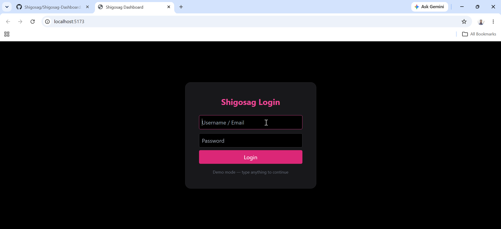
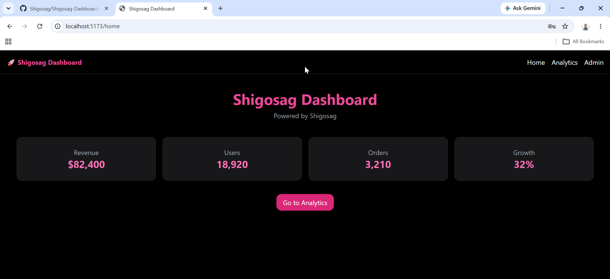
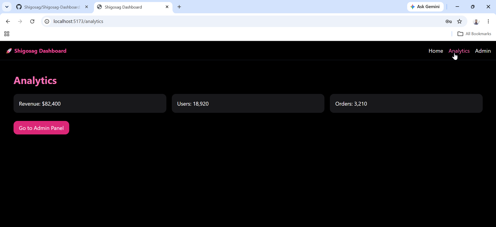
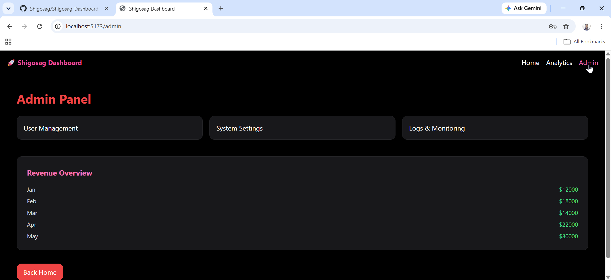
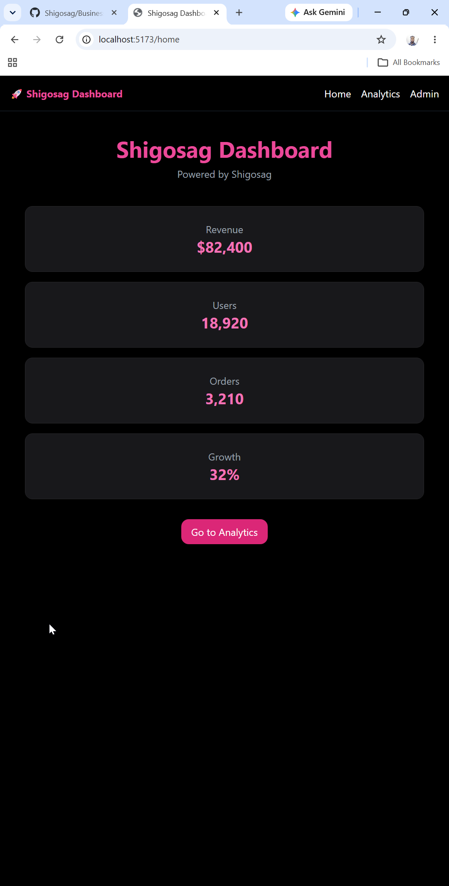
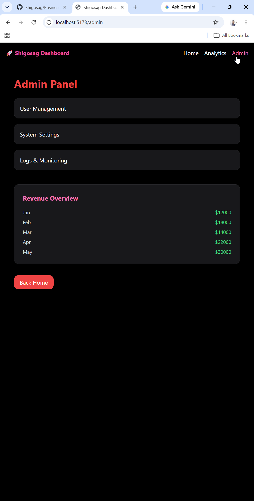

# 🚀 Shigosag Dashboard (Full Stack)

[](https://www.typescriptlang.org/)
[](https://nodejs.org/)
[](LICENSE)

A modern full-stack dashboard system with **React frontend + Node.js backend**, built for scalable UI, API structure, and portfolio/demo use.

---

## 🌐 Live Demo

🚀 **Visit Shigosag Dashboard:**  
https://shigosag-dashboard.up.railway.app

---

💖 Powered by Shigosag  
👤 Author: Shigosag  



### 🎥 System Walkthrough & Demo

<div align="center">
  <video src="https://github.com/user-attachments/assets/71bc50be-2402-4495-ae8c-e11bc88a5e56" width="100%" controls></video>
</div>

**Timestamps:**
- **0:00** - Server Terminal
- **0:08** - Login Flow
- **0:36** - Dashboard Overview
- **0:50** - Analytics
- **1:01** - Admin Panel
- **1:35** - GitHub Repository Overview
  
---

## ✨ Features

### Frontend
- ⚡ React + Vite + TypeScript
- 🎨 Dark modern SaaS UI (pink/rose theme)
- 📊 Dashboard pages (Home, Analytics, Admin)
- 🧭 React Router navigation
- 🧩 Reusable components system
- 🔐 Demo login (frontend validation)

### Backend
- 🚀 Node.js + Express API server
- 🌐 REST API structure
- 🔌 Socket support (real-time ready)
- 📦 Scalable service-based architecture
- 🧾 Environment configuration support

---

## 🧱 Tech Stack

### Client
- ⚛️ React
- 📝 TypeScript
- 🌐 React Router DOM
- 🎨 Tailwind CSS (CDN or utility classes)
- ⚡ Vite

### Server
- 🟢 Node.js
- 🚀 Express 5
- 🌐 HTTP Server
- ⏱️ Socket.io (optional real-time layer)

---

## 📁 Project Structure

```text
Shigosag-Dashboard/
│
├── client/
│ ├── src/
│ │ ├── components/
│ │ ├── pages/
│ │ ├── App.tsx
│ │ ├── main.tsx
│ ├── index.html
│ ├── package.json
│
├── server/
│ ├── src/
│ │ ├── app.ts
│ │ ├── server.ts
│ │ ├── routes/
│ │ ├── services/
│ ├── package.json
│
└── README.md
```

----

## 🖼️ Feature Screenshots

### Home


| Analytics | Admin Panel |
| :---: | :---: |
|  |  |

---

## 🚀 Getting Started

## Prerequisites
- Node.js (v18+)
  
---

### 1. Clone repository
```bash
git clone https://github.com/Shigosag/Shigosag-Dashboard.git
cd Shigosag-Dashboard
```

---

## ⚙️ Server Setup

```bash
cd server
npm install
npm run dev
```

Backend runs at: http://localhost:5000

## 🖥️ Client Setup

```bash
cd client
npm install
npm run dev
```

Frontend runs at: http://localhost:5173

---

## 🔐 Demo Login

- Enter any username or password
- Click login
- Redirects to dashboard (no real auth required)

---

## 🔗 API Example

- GET /api/health → server status
- GET /api/dashboard → dashboard data (mock/real-ready)

---

## 🎨 UI Theme

- Primary: 💖 Rose Pink
- Background: ⚫ Black / Dark UI

---

## 📊 Pages

- 🏠 Home → Dashboard overview cards
- 📈 Analytics → Revenue, Users, Orders stats
- 🛠 Admin → Admin management UI (mock panel)
- 🔐 Login → Demo login system (bypass auth)

---

## 🖼️ Mobile Preview

| Home | Admin Panel |
| :---: | :---: |
|  |  |

---

## 🔥 Backend Features

- Express API server
- Modular architecture
- Socket-ready structure
- Environment config support
- Scalable service layer

---

## 📦 Build

Server
```bash
npm run build
```

Client
```bash
npm run build
```

---

## 🌐 Deployment

Recommended
- Backend: Render / Railway / VPS
- Frontend: Vercel / Netlify

---

## ⚠️ Notes

- This is a full-stack demo / portfolio project
- Authentication is simplified for demo mode
- Backend is API-ready for future scaling

---

## 💖 Branding

- Shigosag Dashboard
- Powered by Shigosag
- Designed & Built by Shigosag

---

## 👤 Author & Credits

- **Shigosag**
- Portions of code generated with AI support

💼 Portfolio Dashboard Project, this project is for portfolio/demo use.

---

## 📄 License

MIT License

© 2026 Shigosag

---
